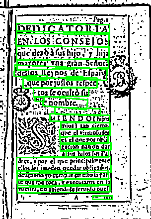

# Mini OCR Scanner 📄➡️📝

**An End-to-End Historical Document OCR Pipeline** built with Python, OpenCV, CRAFT, TrOCR, and Google Gemini.

This project was built to demonstrate how to handle complex OCR tasks (like 17th-century Spanish texts blocks) by combining computer vision preprocessing, deep learning detection/recognition, and LLM-based post-correction.



## 🚀 Features

*   **PDF to Image**: Converts multi-page PDFs into high-res images.
*   **Preprocessing**: Advanced `OpenCV` pipeline (adaptive thresholding, deskewing) to clean noisy documents.
*   **Text Detection**: Uses **CRAFT** (Character Region Awareness for Text Detection) to locate text with high precision.
*   **Text Recognition**: Uses **Microsoft TrOCR** (Transformer-based OCR) for state-of-the-art reading capabilities.
*   **AI Correction**: Uses **Google Gemini** to fix OCR typos and archaic spellings.

## 🛠️ Tech Stack

*   **Python 3.x**
*   **OpenCV** (Image processing)
*   **PyTorch** (Deep Learning backend)
*   **HuggingFace Transformers** (TrOCR model)
*   **craft-text-detector** (Text detection)
*   **Google GenAI** (LLM correction)

## 📦 Installation

1.  Clone the repository:
    ```bash
    git clone https://github.com/yourusername/mini-ocr-scanner.git
    cd mini-ocr-scanner
    ```

2.  Create a virtual environment:
    ```bash
    python -m venv venv
    source venv/bin/activate  # On Windows: venv\Scripts\activate
    ```

3.  Install dependencies:
    ```bash
    pip install -r requirements.txt
    ```
    *(Note: You may need to install Poppler for `pdf2image` separately).*

## 🏃 Usage

### 1. Set API Key
Set your Gemini API key as an environment variable:
```bash
# Windows (PowerShell)
$env:GEMINI_API_KEY = "your_api_key_here"

# Linux/Mac
export GEMINI_API_KEY="your_api_key_here"
```

### 2. Run Single Image Test
To test the pipeline on a single image:
```bash
python test_single_image.py
```
*   Input: `imageOriginal.png` (default)
*   Output: `output/test_raw_ocr.txt`

### 3. Run Full Pipeline
To process an entire PDF document:
```bash
python main.py
```

## 🧠 Architecture
1.  **Input** → PDF/Image
2.  **Clean** → Grayscale + Threshold + Deskew
3.  **Detect** → CRAFT Model (finds words)
4.  **Recognize** → TrOCR (reads text crops)
5.  **Correct** → Gemini LLM (fixes context/spelling)
6.  **Output** → Clean text file

## 🐛 Troubleshooting
If you encounter `ImportError` from `torchvision` or `numpy` shape errors, check the `craft-text-detector` version. This project includes manual patches for compatibility with modern PyTorch/Numpy versions.

## 🤝 Contributing
Feel free to open issues or submit PRs!

## 📜 License
MIT License
